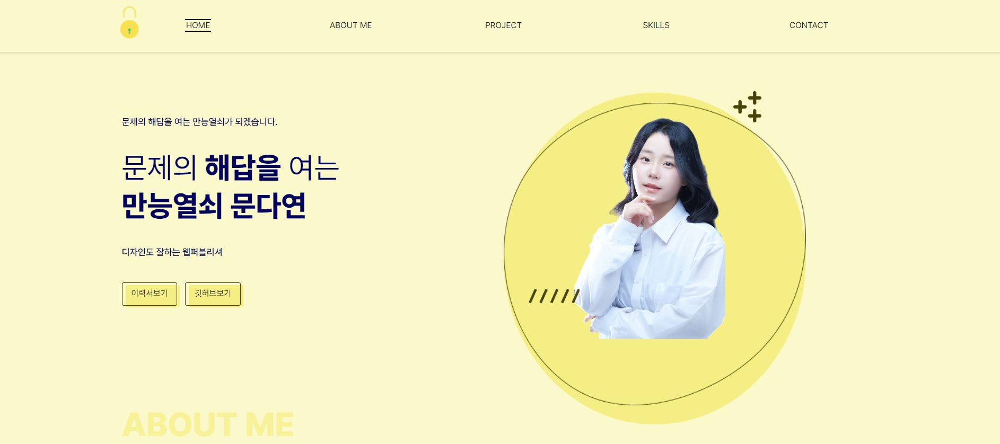
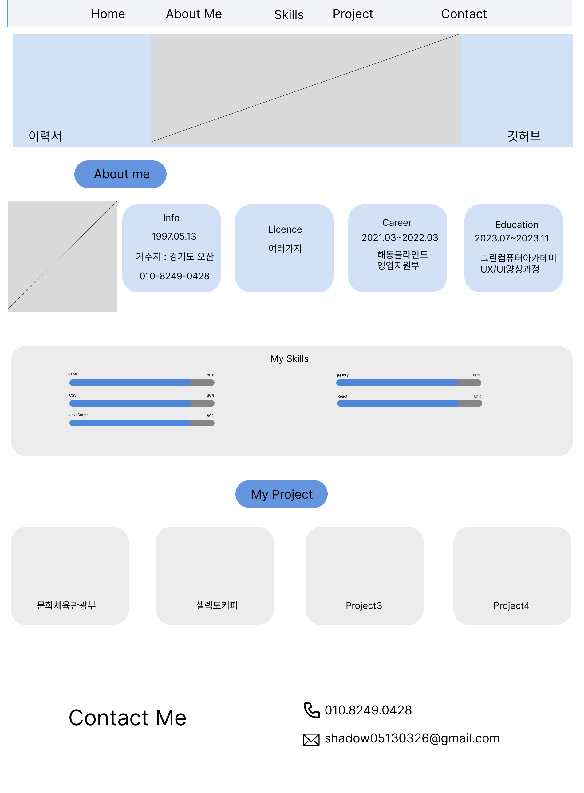

# 문다연의 포트폴리오 입니다.

> 간략한 프로젝트 소개 문구를 작성합니다.

한 두 문단으로 프로젝트 소개 글을 작성합니다.



## 콘셉트 도출

### 마인드맵

> 저를 브랜딩 하기 위해 아이디어 도출의 첫 단계로 마인드 맵을 작성하였습니다.

### 스타일가이드


### 프로토타입

[❤ 피그마프로토타입 보러가기](https://www.figma.com/file/VhTH0qqvo7ZNbFcKXFI72p/%EB%AC%B8%EB%8B%A4%EC%97%B0?type=design&node-id=0%3A1&mode=design&t=N4HMUn8uBWyI76hb-1)


### 와이어프레임 스케치


## 기술사양

jQuery-3.7.1

## 개발 환경 설정

모든 개발 의존성 설치 방법과 자동 테스트 슈트 실행 방법을 운영체제 별로 작성합니다.

    ```sh
    make install
    npm test
    ```

## 업데이트 내역

- 0.2.1
  - 수정: 문서 업데이트 (모듈 코드 동일)
- 0.2.0
  - 수정: `setDefaultXYZ()` 메서드 제거
  - 추가: `init()` 메서드 추가
- 0.1.1
     \* 버그 수정: `baz()` 메서드 호출 시 부팅되지 않는 현상 (@컨트리뷰터 감사합니다!)
- 0.1.0
  - 첫 출시
  - 수정: `foo()` 메서드 네이밍을 `bar()`로 수정
- 0.0.1
  - 작업 진행 중

## 정보

이름 – [@트위터 주소](https://twitter.com/dbader_org) – 이메일주소@example.com

XYZ 라이센스를 준수하며 `LICENSE`에서 자세한 정보를 확인할 수 있습니다.

[https://github.com/yourname/github-link](https://github.com/dbader/)